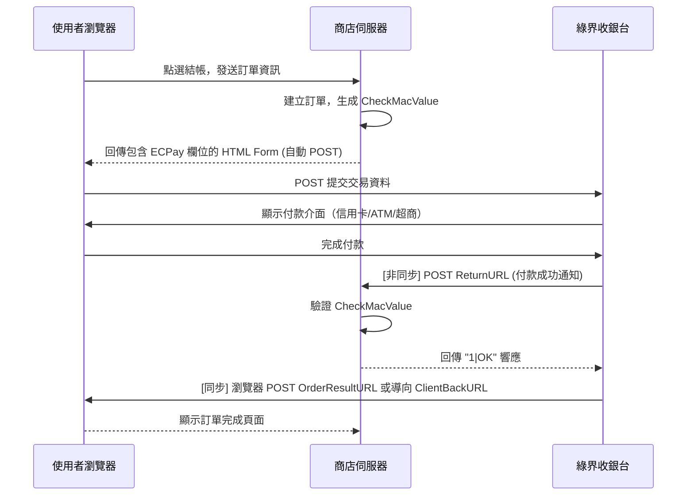

# 綠界科技開發者技能 (ECPay Developers Skill)

此技能定義了在 `DAILY MATE` 中串接、偵錯以及實作「ECPay 綠界科技全方位金流與物流」時的標準開發規範與 API 技術細節。

## 1. 測試環境設定 (Stage Environment)

在開發與測試階段，一律使用綠界提供的測試參數。

| 參數項目 | 金流測試設定 (AioCheckOut) | 物流測試設定 (Express) |
| :--- | :--- | :--- |
| **MerchantID (商店代號)** | `2000132` | `2000132` |
| **HashKey** | `5294y06JbISpM5x9` | `5294y06JbISpM5x9` |
| **HashIV** | `v77hoKGq4kWxNNIS` | `v77hoKGq4kWxNNIS` |
| **API 串接網址** | `https://payment-stage.ecpay.com.tw/Cashier/AioCheckOut/V5` | `https://logistics-stage.ecpay.com.tw/Express/Create` |

---

## 2. 檢查碼 (CheckMacValue) 產生演算法

CheckMacValue 是綠界交易安全防護的核心，任何參數的缺漏或排序錯誤都會導致 `10200056: 交易失敗，傳送參數 CheckMacValue 錯誤`。

### 產生步驟：

1. **排序參數**：將所有要傳送的參數名稱（不包含 `CheckMacValue` 本身）依照 **Alphabetical Order (A-Z)** 排序。
2. **組合字串**：將排序後的參數以 URL 鍵值對格式（`Key=Value`）與 `&` 符號組合。
3. **加入金鑰**：在組合字串的最前方加上 `HashKey=5294y06JbISpM5x9`，並在最後方加上 `HashIV=v77hoKGq4kWxNNIS`。
   - 格式：`HashKey=xxxx&Key1=Value1&Key2=Value2...&HashIV=yyyy`
4. **URL 轉碼 (Encode)**：將整串字串進行 URL Encode。
   - **注意**：綠界採用 RFC 1866 標準，部分字元轉碼規則需手動修正：
     - 空格轉為 `+`
     - `.`, `-`, `*`, `_`, `(`, `)`, `!` 等字元**不轉碼**。
     - 轉碼後的所有英文字母必須為**大寫**（例如 `%2f` 需轉成 `%2F`）。
5. **雜湊加密**：將轉碼後的字串轉為**全小寫**，然後進行 **SHA256** 雜湊運算得到 hex string。
6. **轉為大寫**：將得到的 SHA256 雜湊結果轉換為**全大寫**，即為最終的 `CheckMacValue`。

---

## 3. 金流串接與付款 Callback 流程

### ReturnURL 實作規範 (重要)
- `ReturnURL` 必須為**外網可存取且具備安全憑證 (https) 的 API 網址**。
- 後端接收到綠界的非同步通知時，必須：
  1. 重新計算接收到參數的 `CheckMacValue` 並與傳入的 `CheckMacValue` 比對驗證。
  2. 檢查 `RtnCode` 是否為 `1`（代表交易成功）。
  3. 比對交易金額 `TradeAmt` 是否與資料庫中該訂單的金額一致。
  4. 確認無誤後更新訂單狀態為「已付款 (Paid)」。
  5. **必須回傳 `1|OK` 給綠界**，否則綠界會判斷傳送失敗並持續嘗試重送。

---

## 4. 物流與超商取貨 (C2C / B2C)

### 電子地圖 (ServerReplyURL)
- 用於讓使用者在結帳時選擇超商門市。
- 呼叫電子地圖 API 後，綠界會把使用者導向超商地圖頁面。使用者選定門市後，綠界會將門市資訊（門市代號 `CVSStoreID`、門市名稱 `CVSStoreName` 等）以 POST 方式傳送至商店設定的 `ServerReplyURL`。
- `ServerReplyURL` 接收到門市資料後，需將門市資料存入 Session 或 Cookie，再將使用者導回結帳頁面以繼續填寫收件資訊。
